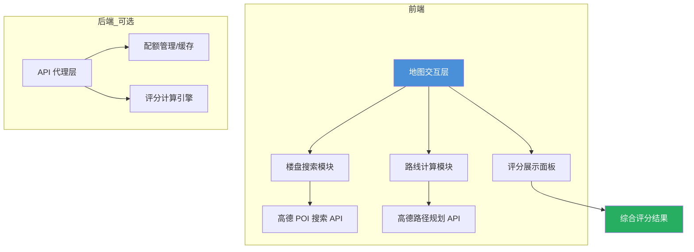
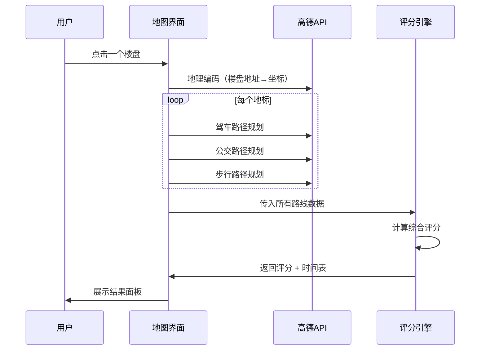

# 北京楼盘通勤分析地图 — 开发规划

## 📊 百度地图 vs 高德地图 API 对比分析

### 免费配额对比（个人开发者）

| 服务类别 | 高德地图（Amap） | 百度地图（Baidu） |
|:---|:---|:---|
| **路线规划**（驾车/公交/步行/骑行） | **150,000次/月**（≈5,000/天） | 5,000次/天 |
| **地点检索**（POI搜索） | **5,000次/月** | ⚠️ 100次/天（≈3,000/月） |
| **地理编码** | 含在基础LBS中 | 5,000次/天 |
| **逆地理编码** | 含在基础LBS中 | ⚠️ 300次/天 |
| **实时路况** | 需高级API | 2,000次/天 |
| **超额价格** | 30元/万次（基础LBS） | 需联系商务 |

### 场景需求分析

核心功能流程：
1. 在地图上浏览/搜索北京楼盘（需要 **POI搜索**）
2. 点击楼盘 → 计算到多个地标的路线（需要 **路线规划 × N个地标 × 3种出行方式**）
3. 获取公交换乘次数、步行距离等细节（需要 **公交路径规划**）

**调用量估算：** 一次会话浏览 20 个楼盘 × 5 个地标 × 3 种出行方式 = **300次路线规划调用**。高德月配额 15 万次绰绰有余，百度日配额 5000 次也够用。但 POI 搜索方面高德 5000 次/月 > 百度 3000 次/月。

### 🏆 推荐结论：高德地图（Amap）

| 维度 | 高德优势 |
|:---|:---|
| **POI 搜索配额** | 5,000/月，是百度的约 1.7 倍 |
| **公交数据** | 北京公交/地铁数据丰富，换乘次数、步行距离等字段更详细 |
| **JS API** | JS API 2.0 更现代，支持 3D 地图 |
| **路径规划 2.0** | 有新版 API，返回数据更丰富（途径站点、换乘详情） |
| **超额价格** | 30元/万次，价格透明 |
| **生态** | 2025年新增 MCP Server、CLI 工具、SKILL 专区 |

---

## 🏗️ 技术栈

```
前端框架：React 18 + TypeScript
构建工具：Vite
地图 SDK：高德 JS API 2.0
样式方案：Tailwind CSS
状态管理：Zustand
后端（可选）：Node.js (Express) — 用于 API 代理与配额管理
数据持久化：LocalStorage / IndexedDB（地标配置 + 路线缓存）
```

---

## 系统架构



---

## 核心数据流



---

## 开发阶段规划

### 第一阶段：基础地图 & 地标管理（预计 1-2 周）

- [ ] 高德开发者注册、获取 API Key
- [ ] 地图初始化、北京区域定位
- [ ] 地标管理功能（添加/编辑/删除常去地标）
  - 支持输入地址或在地图上点选
  - 分类：我家、老婆公司、我的公司、常去商圈等
- [ ] 地标数据本地存储（LocalStorage / IndexedDB）

### 第二阶段：楼盘搜索 & 展示（预计 1-2 周）

- [ ] POI 搜索集成（搜索"楼盘"、"小区"等关键词）
- [ ] 地图上标记楼盘位置（Marker 聚类）
- [ ] 点击楼盘弹出信息卡片
  - 名称、地址、均价（可手动补充）
- [ ] 楼盘列表视图（侧边栏）

### 第三阶段：路线计算核心（预计 2-3 周）

- [ ] 单楼盘 → 单地标路线计算
  - 🚗 驾车路线（时间、距离、红绿灯数）
  - 🚌 公交路线（时间、换乘次数、步行距离、线路名称）
  - 🚶 步行路线（时间、距离）
- [ ] 批量计算（一个楼盘 → 所有地标）
- [ ] 路线结果可视化展示（时间表格）

### 第四阶段：评分系统（预计 1-2 周）

评分模型设计：

$$\text{Score} = \sum_{i=1}^{n} w_i \cdot \left( \alpha \cdot S_{transit} + \beta \cdot S_{driving} + \gamma \cdot S_{walking} \right)$$

其中：
- $w_i$ = 地标权重（公司 > 常去商圈 > 偶尔去的地方）
- 公交得分 $S_{transit}$：考虑时间、换乘次数、步行距离
- 驾车得分 $S_{driving}$：考虑时间、拥堵程度
- $\alpha, \beta, \gamma$ = 出行方式偏好权重（用户可调）

评分维度：
- [ ] 通勤时间（核心指标）
- [ ] 换乘便利性（换乘次数越少越好）
- [ ] 末班车安全性（加班场景适配）
- [ ] 高峰期 vs 平峰期时间差异
- [ ] 综合加权评分

### 第五阶段：高级功能（预计 2-3 周）

- [ ] 365天通勤模拟（基于历史路况数据估算不同日期的出行时间）
- [ ] 多个楼盘对比模式
- [ ] 热力图展示（哪些区域通勤最便利）
- [ ] 导出报告功能
- [ ] 响应式适配（移动端查看）

---

## 项目目录结构

```
house_map/
├── index.html
├── package.json
├── vite.config.ts
├── tailwind.config.js
├── tsconfig.json
├── plan.md                        # 本文件
├── src/
│   ├── main.tsx                   # 入口
│   ├── App.tsx                    # 根组件
│   ├── components/
│   │   ├── MapContainer.tsx       # 地图主组件
│   │   ├── LandmarkManager.tsx    # 地标管理面板
│   │   ├── SearchPanel.tsx        # 楼盘搜索
│   │   ├── RoutePanel.tsx         # 路线详情面板
│   │   ├── ScoreCard.tsx          # 评分卡片
│   │   └── CompareTable.tsx       # 多楼盘对比
│   ├── services/
│   │   ├── amap.ts               # 高德API封装
│   │   └── scoreEngine.ts        # 评分计算引擎
│   ├── stores/
│   │   ├── landmarkStore.ts      # 地标状态管理
│   │   └── routeStore.ts         # 路线缓存管理
│   ├── types/
│   │   └── index.ts              # 类型定义
│   └── utils/
│       └── formatters.ts         # 格式化工具
```

---

## ⚠️ 关键注意事项

1. **API 调用优化**：同一起终点、同一出行方式的路线应缓存，避免重复调用消耗配额
2. **QPS 限制**：个人开发者 QPS 较低，批量计算时需加延迟控制（建议每次调用间隔 300-500ms）
3. **坐标系统**：高德使用 GCJ-02 坐标系，与其他地图来源数据对接时需转换
4. **公交数据时效性**：公交线路可能调整，建议定期刷新缓存
5. **配额监控**：建议在后端代理层添加配额使用量监控，接近上限时告警
6. **API Key 安全**：如果部署到公网，API Key 应放在后端代理，不要暴露在前端代码中
